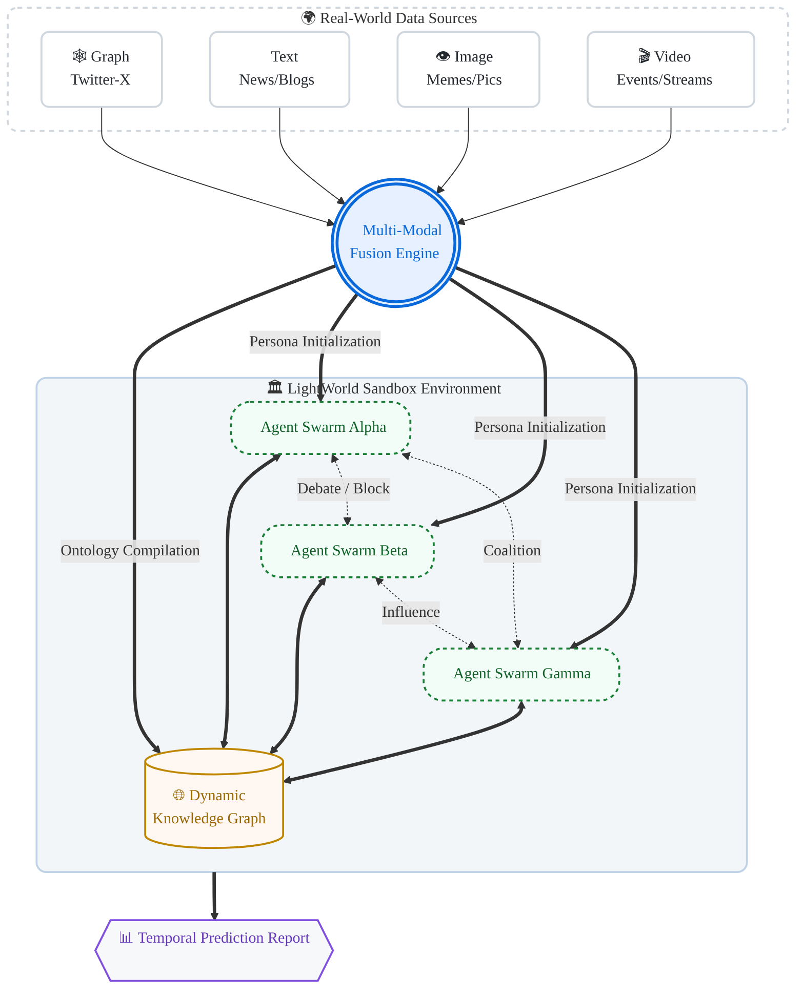

<div align="center">


# `L I G H T W O R L D`

### Matrix / Cyberpunk Protocol

**Lightweight · Omni-Modal · Emergent Social Simulation & Prediction Engine**

[](https://opensource.org/licenses/AGPL-3.0)
[](#-quick-start--boot-protocol)
[](#-matrix-architecture)
[](#-core-capabilities)


*"In minimalist code, we simulate the reflection of the entire world."*

[English](#) · [简体中文](#) · [Project Whitepaper](#) · [Video Demo](#)

</div>

---

## `> system.dashboard`

| Channel         | Status | Throughput   | Note                              |
| --------------- | ------ | ------------ | --------------------------------- |
| Graph Ingestion | ONLINE | 98%          | topology + influence edges        |
| Text Stream     | ONLINE | 82%          | news, posts, narratives           |
| Image Parser    | ONLINE | 91%          | meme semantics + visual sentiment |
| Video Tracker   | ONLINE | 76%          | event timeline + motion cues      |
| Swarm Runtime   | ACTIVE | 100k+ agents | debate, clustering, polarization  |

```bash
$ lightworld --init matrix
> [SYSTEM] Booting Light Engine... [OK]
> [DATA] Graph/Text/Image/Video streams attached... [OK]
> [AGENT] 100,000 autonomous agents online... [OK]
> [STATUS] Simulation ACTIVE. Predicting trajectory shifts...
┌───────────────────────── LIGHTWORLD RUNTIME MATRIX ─────────────────────────┐
│ Attention Heatmap   ████████████░░░░  72%                                   │
│ Narrative Volatility █████████████░░░  79%                                   │
│ Polarization Index   ██████████░░░░░░  63%                                   │
│ Intervention Window  ███████████████░  91%                                   │
└───────────────────────────────────────────────────────────────────────────────┘
```

---

## 👁️‍🗨️ Concept: `LIGHT + WORLD`

Current AI agent systems often face three bottlenecks:

- **Token Waste**: repeated heavyweight context and expensive monolithic calls.
- **Zero Sharing**: isolated execution with limited experiential transfer.
- **Text-Only Blindness**: weak grounding in visual and dynamic reality.

**lightworld** breaks this deadlock through two design axes:

- **⚡ LIGHT (Minimalist & Lightweight)**  
  Experience sharing + dynamic context compression reduce concurrent simulation cost by orders of magnitude.

- **🌍 WORLD (Real-World Mapping)**  
  Native ingestion for **Graph (social topology)**, **Text (public narratives)**, **Image (visual sentiment)**, and **Video (event dynamics)**.

---

## 🧬 Core Capabilities

<details>
<summary><b>🕸️ Multi-Source Graph Injection</b></summary>
<br>
Import social topology (e.g., X/Twitter) as first-class simulation physics. The engine reconstructs implicit power networks from follows, reposts, and likes to model KOLs, bot swarms, and peripheral groups.
</details>


<details>
<summary><b>🎬 Omni-Modal Sensory Input</b></summary>
<br>
Agents ingest not just text reports, but also videos and memes. Visual sentiment and event cues are injected directly into decision and emotion update modules.
</details>


<details>
<summary><b>🧠 Self-Evolving Swarm Intelligence</b></summary>
<br>
20+ social actions (follow, repost, debate, block, coalition, etc.) produce emergent phenomena such as echo chambers, cascades, and polarization.
</details>


<details>
<summary><b>📈 Temporal What-If Forecaster</b></summary>
<br>
Inject shocks at runtime (debunk release, node failure, policy intervention) and measure trajectory divergence across demographics over time.
</details>


---

## 🧱 Matrix Architecture

*Dynamic data flow and system architecture:*



---

## ⚙️ Action Space Snapshot

| Layer       | Representative Actions                       | Emergent Effect          |
| ----------- | -------------------------------------------- | ------------------------ |
| Information | read, summarize, amplify, suppress           | narrative drift          |
| Social      | follow, mention, debate, block, cluster      | faction formation        |
| Cognitive   | update memory, adjust bias, confidence decay | belief polarization      |
| Strategic   | coordinate campaign, react to intervention   | cascade or stabilization |

---

## 🧪 Scenario Injection Examples

- **Deepfake Shock**: inject high-intensity visual rumor at `t=3`.
- **Debunk Counterwave**: release correction narrative at `t=9`.
- **Node Failure**: disable key financial/information hub at runtime.
- **Policy Intervention**: increase moderation threshold for a target cluster.

---

## 📦 Quick Start | Boot Protocol

```bash
# 1) Access the Matrix
git clone https://github.com/JayLZhou/LightWorld.git
cd LightWorld

# 2) Install cybernetic implants
pip install -r requirements.txt
playwright install

# 3) Ignite the world
python engine.py --mode matrix \
  --graph ./data/twitter_seed.json \
  --video ./data/breaking_news.mp4
```

### Minimal Graph Seed (`data/twitter_seed.json`)

```json
{
  "nodes": [
    {"id": "kol_01", "role": "KOL", "stance": 0.65, "followers": 320000},
    {"id": "group_a_01", "role": "citizen", "stance": 0.20, "followers": 540},
    {"id": "bot_01", "role": "bot", "stance": -0.75, "followers": 1200}
  ],
  "edges": [
    {"source": "group_a_01", "target": "kol_01", "type": "follow", "weight": 0.80},
    {"source": "bot_01", "target": "group_a_01", "type": "repost", "weight": 0.60}
  ],
  "events": [
    {"t": 3, "type": "video_injection", "payload": {"sentiment": -0.4}},
    {"t": 9, "type": "debunk_release", "payload": {"strength": 0.7}}
  ]
}
```

> 💡 **Offline Protocol**: For zero-API-cost local deployment, see `Offline-Deployment-Guide.md`.

---

## 🏆 Hall of Inspiration & Acknowledgments

**lightworld** stands on the work of pioneering open-source teams:

- 🐟 **[MiroFish](https://github.com/666ghj/MiroFish) (by @666ghj)**  
  *"The micro-laboratory for predicting everything."* Foundational digital-sandbox interaction ideas and graph-memory mechanisms.
- 🏝️ **[OASIS](https://github.com/camel-ai/oasis) (by CAMEL-AI)**  
  *"The lawgiver of million-agent societies."* Core inspiration for large-scale social-action architecture.

---

## 🛣️ Roadmap Signal

- [ ] Public benchmark scenarios (financial rumor / election narrative / crisis communication)
- [ ] Plug-in adapters for Reddit, Discord, and newswire feeds
- [ ] Reproducible evaluation suite for intervention policy tests
- [ ] End-to-end offline million-agent deployment tutorial

<div align="center">

</div>
