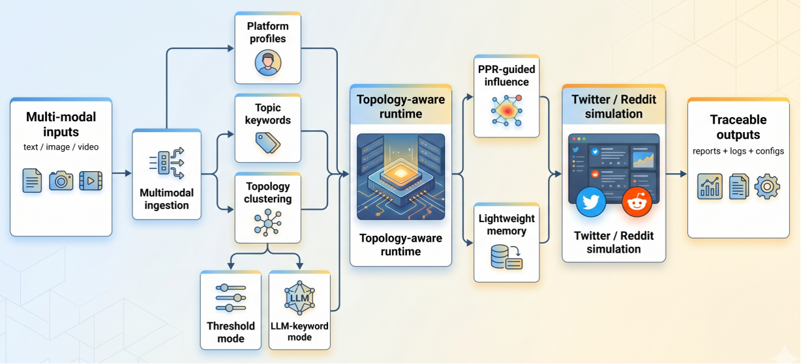
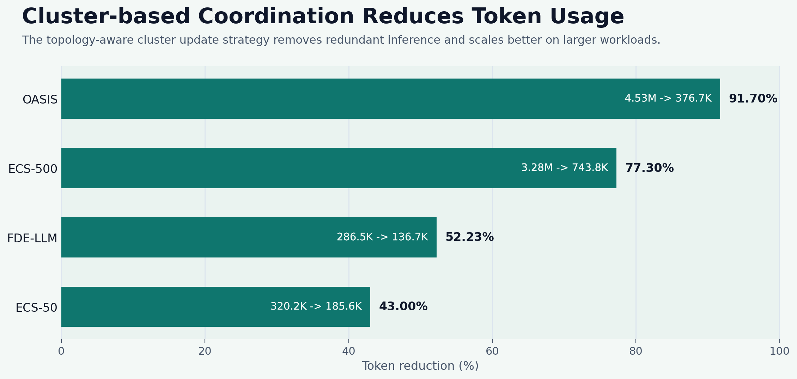
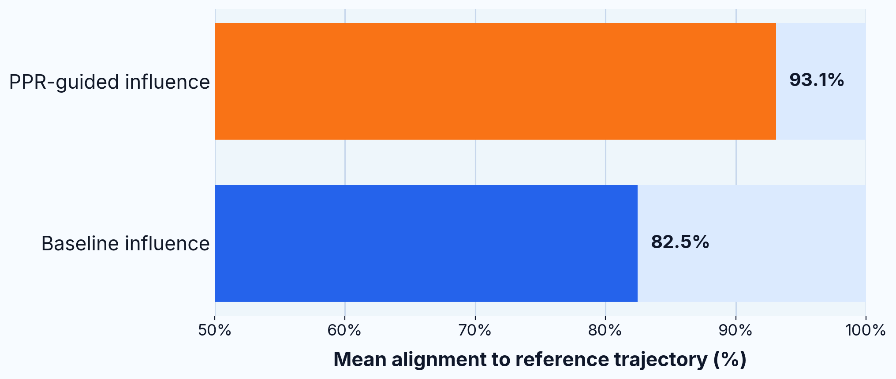
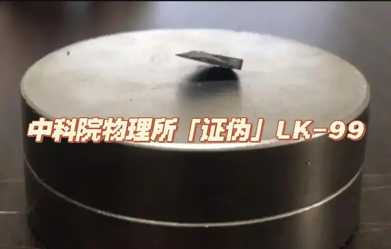
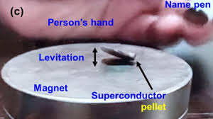
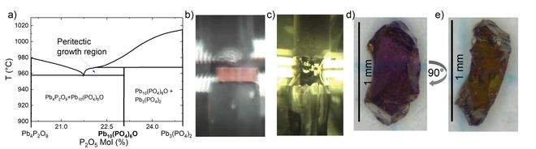

<div align="center">


### Multi-modal event analysis and social simulation✨

**A lightweight system for turning event materials into structured graphs, agent populations, and inspectable social simulations.**

[](https://d2i-cuhksz.github.io/MicroWorld/)
[](pyproject.toml)
[](LICENSE)

[Project Site](https://d2i-cuhksz.github.io/MicroWorld/) ·
[Architecture](https://d2i-cuhksz.github.io/MicroWorld/architecture.html) ·
[User Guide](https://d2i-cuhksz.github.io/MicroWorld/guide.html) ·
[Examples](https://d2i-cuhksz.github.io/MicroWorld/examples.html)

</div>

## 🕵️‍♂️ Overview

**MicroWorld** starts from raw event material: 📄 documents, 🖼️ images, 🎥 videos, and 🕸️ graph-ready context. It builds an event graph, derives platform-facing agent profiles, runs a multi-agent discussion process, and keeps the intermediate artifacts available for inspection after the run!

🎯 **Why MicroWorld?** It is built for cases where *the final report is not enough on its own*. The project keeps the graph 📊, prompts 💬, simulation inputs 🎬, action traces 👣, memory states 🧠, and report outputs 📑 tied to the same run.

## 🏛️ System Architectur

<p align="center">
  
</p>


MicroWorld is organized around four key stages:

1. 📥 **Ingestion and graph build**: Convert event materials into ontology, entities, and relations.
2. ⚙️ **Simulation preparation**: Derive topic keywords, cluster topology, and generate platform profiles.
3. 🏃‍♂️ **Runtime execution**: Run the topology-aware simulation with directional influence and lightweight memory.
4. 📈 **Reporting and inspection**: Collect logs, traces, configs, and reports from the same run.

## ✨Key Contributions

<table>
  <tr>
    <td width="20%" valign="top" align="center">
      
      <br />
      <strong>Multi-modal Event Ingestion</strong>
      <br />
      <sub>Handles text, image, and video inputs in one unified workflow.</sub>
    </td>
    <td width="20%" valign="top" align="center">
      
      <br />
      <strong>Two Topology Clustering Modes</strong>
      <br />
      <sub>Supports both threshold-based and LLM-keyword-driven clustering.</sub>
    </td>
    <td width="20%" valign="top" align="center">
      
      <br />
      <strong>PPR-guided Directional Influence</strong>
      <br />
      <sub>Models activation and information flow with topology-aware influence.</sub>
    </td>
    <td width="20%" valign="top" align="center">
      
      <br />
      <strong>Lightweight Memory</strong>
      <br />
      <sub>Preserves useful state incrementally without full-history replay.</sub>
    </td>
    <td width="20%" valign="top" align="center">
      
      <br />
      <strong>Inspectable Outputs</strong>
      <br />
      <sub>Keeps graph artifacts, traces, configs, and reports available for inspection.</sub>
    </td>
  </tr>
</table>

> 💡 **Efficiency Boost**: Removes redundant updates and cuts token usage sharply as workloads grow. Keeps the simulation trajectory closer to the reference trend than the baseline run! 📉

<table>
  <tr>
    <td width="50%" valign="top" align="center">
      
    </td>
    <td width="50%" valign="top" align="center">
      
    </td>
  </tr>
  <tr>
    <td valign="top" align="center">
      <sub>Removes redundant updates and cuts token usage sharply as workloads grow.</sub>
    </td>
    <td valign="top" align="center">
      <sub>Keeps the simulation trajectory closer to the reference trend than the baseline run.</sub>
    </td>
  </tr>
</table>

## 🧪Example: LK-99

The public example uses the LK-99 room-temperature-superconductor news cycle. It is a good fit for the project because it contains:

- 🧩 **Mixed evidence types**, including long-form text and videos.
- 🎢 **A clear shift** from early excitement to later scrutiny.
- 🗣️ **Visible changes** in narrative focus, participants, and discussion structure.

<p align="center">
  
  
</p>
<p align="center">
  
  
</p>

## 🚀Quick Start

### 1️⃣ Clone the repository

```bash
git clone https://github.com/d2i-cuhksz/MicroWorld.git
cd MicroWorld
```

### 2️⃣ Prerequisites 🛠️

**Required:**

* 🐍 Python 3.11+
* ⚡ `uv`

**Recommended for video inputs:**

* 🎞️ `ffmpeg`
* 🎞️ `ffprobe`

> *(If `ffmpeg` and `ffprobe` are not on your PATH, set `MULTIMODAL_FFMPEG_PATH` and `MULTIMODAL_FFPROBE_PATH` in `.env`)*

### 3️⃣ Configure environment variables 🔐

```bash
cp .env.example .env
```

**Set at least:**

```env
LLM_API_KEY=your_key
ZEP_API_KEY=your_key
```

**Common defaults:**

```env
LLM_BASE_URL=https://dashscope.aliyuncs.com/compatible-mode/v1
LLM_MODEL_NAME=qwen-plus
MULTIMODAL_AUDIO_API_KEY=
MULTIMODAL_AUDIO_BASE_URL=
```

### 4️⃣ Install dependencies 📦

```bash
uv sync
```

### 5️⃣ Start the API service 🔌

```bash
uv run microworld-api
```

> *(The backend uses `FLASK_HOST`, `FLASK_PORT`, and `FLASK_DEBUG` from the environment. The default backend port is **5001**.)*

### 6️⃣ Create a run config 📝

```bash
cp configs/full_run/full_run.template.json /tmp/microworld-run.json
```

**Minimal example:**

```json
{
  "project_name": "My MicroWorld Run",
  "graph_name": "My MicroWorld Graph",
  "simulation_requirement": "Build entities, relations, and a two-platform social simulation from the input materials.",
  "files": [
    "/abs/path/to/event.md",
    "/abs/path/to/video.mp4"
  ],
  "pipeline": {
    "chunk_size": 500,
    "chunk_overlap": 50,
    "batch_size": 3
  },
  "simulation": {
    "enable_twitter": true,
    "enable_reddit": true
  },
  "report": {
    "generate": false
  }
}
```

> *(You can also leave `files` empty and provide `files_from`, with one local path per line.)*

### 7️⃣ Run the full pipeline 🚂

```bash
uv run microworld-full-run \
  --config /abs/path/to/microworld-run.json
```

**To avoid the interactive clustering choice:**

```bash
uv run microworld-full-run \
  --config /abs/path/to/microworld-run.json \
  --cluster-method threshold
```

**Generated data is written under:** 📁

* `data/generated/`
* `output/simulations/`
* `output/reports/`
* `runs/`

---

## ⌨️ Main Commands

| Command                                            | Description                      |
| -------------------------------------------------- | -------------------------------- |
| `uv run microworld-api`                            | 🔌 Start the API backend          |
| `uv run microworld-local-pipeline --config <path>` | 🔄 Run the local pipeline         |
| `uv run microworld-parallel-sim --config <path>`   | 🏃‍♂️ Run parallel simulation       |
| `uv run microworld-full-run --config <path>`       | 🌍 Run the entire MicroWorld flow |

---

## 📂 Outputs

A typical run exposes artifacts from several stages:

* 🏗️ **Project build:** Extracted text, parsed multimodal content, source manifests, ontology output.
* 🎭 **Simulation preparation:** Entity prompts, graph snapshots, social relation graph, simulation config.
* 🎬 **Runtime execution:** Platform profiles, action logs, memory states, topology traces.
* 📊 **Reporting:** Report outline, full report, agent logs, console logs.

---

## 🌲 Repository Structure

```text
MicroWorld/
├── 📄 pyproject.toml
├── 📁 src/
│   └── 📁 microworld/
│       ├── 🔌 api/
│       ├── 📱 application/
│       ├── ⌨️ cli/
│       ├── ⚙️ config/
│       ├── 🧩 domain/
│       ├── 🕸️ graph/
│       ├── 📥 ingestion/
│       ├── 🏗️ infrastructure/
│       ├── 🧠 memory/
│       ├── 📊 reporting/
│       ├── 🏃 simulation/
│       ├── 💾 storage/
│       ├── 📡 telemetry/
│       └── 🛠️ tools/
├── 📁 configs/
│   ├── 🏃 full_run/
│   └── 🎬 simulation/
├── 📁 data/
│   └── 🏗️ generated/
├── 📁 docs/
└── 📁 tests/
```

---

## 🧑‍💻 Development

Want to contribute or run tests?

```bash
uv sync --group dev
uv run pytest
```

---

## 🙏 Acknowledgements

MicroWorld is built on top of prior open-source efforts. We would like to thank [MiroFish](https://github.com/666ghj/MiroFish) and [OASIS](https://github.com/camel-ai/oasis) for making their work publicly available. Our project extends and adapts ideas and implementation foundations from these repositories for a lightweight, topology-aware, multi-modal social simulation workflow.

---

## License

MicroWorld is released under the [GNU Affero General Public License v3.0](LICENSE).

<div align="center">


</div>
