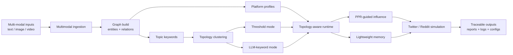

<div align="center">


# MicroWorld

**A lightweight multi-modal social simulation engine for public-event analysis, topology-aware runtime scheduling, memory-efficient execution, and report generation.**

[](https://d2i-cuhksz.github.io/LightWorld/)
[](pyproject.toml)
[](LICENSE)
[](src/microworld/cli/api.py)
[](#what-microworld-does)

[Project Site](https://d2i-cuhksz.github.io/LightWorld/) ·
[Architecture](https://d2i-cuhksz.github.io/LightWorld/architecture.html) ·
[User Guide](https://d2i-cuhksz.github.io/LightWorld/guide.html) ·
[Examples](https://d2i-cuhksz.github.io/LightWorld/examples.html)

</div>

---

## What MicroWorld Does

MicroWorld turns real-world event materials into an inspectable social simulation pipeline. It ingests documents, images, videos, and graph signals, compiles them into ontology and relation artifacts, prepares platform-ready agent profiles, runs Twitter/Reddit-style OASIS simulations, and generates reports that can be inspected after the run.

```text
event materials
  -> multimodal ingestion
  -> ontology and graph build
  -> entity prompts and platform profiles
  -> topology-aware simulation runtime
  -> memory traces, action logs, reports
```

It is designed for scenarios where the question is not only "what does the model answer?", but also "which entities were modeled, who influenced whom, what actions happened, and which artifacts can we inspect afterward?"

## Why It Is Different

| Layer | What it adds | Why it matters |
| --- | --- | --- |
| Multi-modal ingestion | PDF, text, image, and video inputs | Events are not forced into text-only context. |
| Graph construction | Ontology, entities, edges, and graph IDs | Simulation state is grounded in structured event context. |
| Lightweight memory | SimpleMem-style incremental state | The runtime keeps useful traces without replaying everything. |
| Topology-aware scheduling | Representative units and neighborhood activation | The simulation avoids blindly activating every agent every round. |
| Directed influence | PPR-based asymmetric influence signals | Influence can be read as directional instead of symmetric. |
| Report generation | Structured run artifacts and public reports | Outputs are inspectable beyond the final narrative. |

## Repository Snapshot

The public site now presents the LK-99 room-temperature-superconductor news cycle as the main public-facing example while still showing the full MicroWorld pipeline:

| Public-facing signal | What it means |
| --- | --- |
| Multi-modal input package | The example combines long-form text and multiple videos. |
| Cross-platform simulation | The same event is staged as a Twitter/Reddit-style discussion flow. |
| Readable narrative arc | The run moves from hype and speculation to verification and disillusion. |
| Inspectable artifacts | Reviewers can still inspect prompts, configs, topology traces, and reports. |

## LK-99 Demo Glimpse

<p align="center">
  
  
</p>
<p align="center">
  
  
</p>
<p align="center">
  These images help explain the example at a glance: a striking claim, visual evidence fragments, public-facing explanation, and the later move toward technical scrutiny.
</p>

## System Architecture



The simplified view is:

- `Multimodal ingestion` turns raw event materials into structured context.
- `Graph build` produces the entities and relations used downstream.
- `Topic keywords` feed directly into the clustering stage, especially the `LLM-keyword mode`.
- `Topology clustering` currently supports two strategies: `threshold mode` and `LLM-keyword mode`.
- `Topology-aware runtime` is guided by `PPR-based directional influence` and a `lightweight memory` module rather than a full-history replay design.
- Final outputs keep both the high-level report and the detailed simulation artifacts.

MicroWorld keeps the static project site and the backend runtime deliberately separate. GitHub Pages hosts the project narrative, guide, architecture, and example pages; the Flask backend and long-running simulations must be run in a local or separately deployed runtime environment.

## Quick Start

### 1. Clone the repository

```bash
git clone https://github.com/d2i-cuhksz/LightWorld.git
cd LightWorld
```

The GitHub repository path still uses `LightWorld` for now. The runtime package and CLI commands below have already been renamed to `MicroWorld` / `microworld`.

### 2. Install prerequisites

Required:

- Python 3.11+
- `uv`

Optional but recommended for video inputs:

- `ffmpeg`
- `ffprobe`

If `ffmpeg` and `ffprobe` are not on your system `PATH`, set `MULTIMODAL_FFMPEG_PATH` and `MULTIMODAL_FFPROBE_PATH` in `.env`.

### 3. Configure secrets

```bash
cp .env.example .env
```

Set at least:

```bash
LLM_API_KEY=your_key
ZEP_API_KEY=your_key
```

Optional defaults are already present in `.env.example`:

```bash
LLM_BASE_URL=https://dashscope.aliyuncs.com/compatible-mode/v1
LLM_MODEL_NAME=qwen-plus
```

For multimodal audio transcription, the public defaults inherit the main LLM credentials unless you override them:

```bash
MULTIMODAL_AUDIO_API_KEY=
MULTIMODAL_AUDIO_BASE_URL=
```

### 4. Install dependencies

```bash
uv sync
```

### 5. Start the API service

This is optional if you only want to run the CLI pipeline locally.

```bash
uv run microworld-api
```

By default, the Flask service reads `FLASK_HOST`, `FLASK_PORT`, and `FLASK_DEBUG` from the environment, with port `5001` as the default backend port.

### 6. Create a full-run config

The public repository ships a reusable template, but it does not bundle a public raw input package. Create your own config by copying the template and filling in your local files:

```bash
cp configs/full_run/full_run.template.json /tmp/microworld-run.json
```

Minimal example:

```json
{
  "project_name": "My MicroWorld Run",
  "graph_name": "My MicroWorld Graph",
  "simulation_requirement": "Build entities, relations, and a two-platform social simulation from the input materials.",
  "files": [
    "/abs/path/to/event.md",
    "/abs/path/to/video.mp4"
  ],
  "pipeline": {
    "chunk_size": 500,
    "chunk_overlap": 50,
    "batch_size": 3
  },
  "simulation": {
    "enable_twitter": true,
    "enable_reddit": true
  },
  "report": {
    "generate": false
  }
}
```

You can also keep `files` empty and use `files_from` to point at a text file with one input path per line.

### 7. Run the full pipeline

```bash
uv run microworld-full-run \
  --config /abs/path/to/microworld-run.json
```

If you want a non-interactive topology clustering choice, pass one of the supported cluster modes:

```bash
uv run microworld-full-run \
  --config /abs/path/to/microworld-run.json \
  --cluster-method threshold
```

Generated project data, simulation outputs, and reports are written under:

```text
data/generated/
output/simulations/
output/reports/
```

## Command Palette

```bash
# Start the Flask backend.
uv run microworld-api

# Build a local multimodal graph pipeline.
uv run microworld-local-pipeline --config /abs/path/to/local_pipeline.json

# Run a prepared simulation config.
uv run microworld-parallel-sim --config /abs/path/to/simulation_config.json

# Run ingestion, preparation, simulation, and optional report generation.
uv run microworld-full-run --config /abs/path/to/microworld-run.json
```

## Repository Layout

```text
MicroWorld/
  pyproject.toml              # project metadata, dependencies, CLI entry points
  src/
    microworld/               # the main importable Python package
      api/                    # Flask HTTP routes (graph, simulation, report)
      application/            # end-to-end orchestration services
      cli/                    # CLI entry points (api, full_run, local_pipeline, parallel_sim)
      config/                 # settings and environment configuration
      domain/                 # core domain models (project, task)
      graph/                  # graph pipeline, ontology, Zep integration
      ingestion/              # multimodal ingestion, file parsing, text processing
      infrastructure/         # LLM client, retry utilities
      memory/                 # Zep paging and memory utilities
      reporting/              # report agent and report management
      simulation/             # OASIS simulation runtime, topology, platform runners
      storage/                # repositories (project, report, simulation state)
      telemetry/              # logging configuration
      tools/                  # entity prompt extraction
  configs/                    # reusable configuration templates
    full_run/                 # full pipeline run configs
    simulation/               # simulation-specific configs
  data/
    generated/                # runtime-generated data (gitignored)
  docs/                       # GitHub Pages project site
  tests/                      # unit and integration tests
    unit/
    integration/
```

## Generated Artifacts

A full run can expose a consolidated run directory with links or copies to the important artifacts:

| Stage | Representative artifacts |
| --- | --- |
| Project build | `project.json`, `extracted_text.txt`, `parsed_content.json`, `source_manifest.json` |
| Simulation prep | `entity_prompts.json`, `entity_graph_snapshot.json`, `social_relation_graph.json`, `simulation_config.json` |
| Platform runtime | `twitter_profiles.csv`, `reddit_profiles.json`, `twitter_actions.jsonl`, `reddit_actions.jsonl` |
| Memory and topology | `simplemem_twitter.json`, `simplemem_reddit.json`, topology snapshots and traces |
| Reporting | `full_report.md`, `outline.json`, `agent_log.jsonl`, `console_log.txt` |

## Current Status

MicroWorld is currently best understood as a repository-backed research and prototype system:

| Ready now | Not claimed yet |
| --- | --- |
| Static GitHub Pages project site | Hosted public interactive backend |
| Backend API and CLI entry points | Fully managed cloud deployment |
| Public LK-99 case-study pages | General-purpose benchmark suite |
| End-to-end local full-run service | Polished browser upload-and-run product |
| Reusable config templates and inspectable output structure | Public video walkthrough |

## Development Notes

```bash
uv sync --group dev
uv run pytest
```

Tests are organized under `tests/unit/` for unit tests and `tests/integration/` for component-level integration tests.

## License

MicroWorld is released under the [GNU Affero General Public License v3.0](LICENSE).

<div align="center">


</div>
